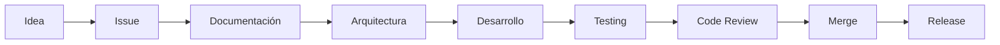

# Engineering Handbook

> Este documento establece los principios, estándares y prácticas de ingeniería que regirán el desarrollo de HomeCapital durante todo su ciclo de vida.

---

# Propósito

El Engineering Handbook define la forma en que el equipo desarrolla software dentro de HomeCapital.

Su objetivo es garantizar:

- Consistencia
- Calidad
- Escalabilidad
- Mantenibilidad
- Seguridad
- Documentación
- Trazabilidad

Este documento es la referencia principal para cualquier persona que participe en el desarrollo del proyecto.

---

# Filosofía del proyecto

HomeCapital se construye bajo cinco principios fundamentales.

## 1. La documentación es parte del software.

Si una funcionalidad no está documentada, se considera incompleta.

---

## 2. La calidad tiene prioridad sobre la velocidad.

Es preferible retrasar una entrega antes que incorporar deuda técnica innecesaria.

---

## 3. Toda decisión importante debe quedar registrada.

Las decisiones técnicas se documentan mediante ADR.

Las decisiones funcionales se registran en Decision Log.

---

## 4. La simplicidad siempre será la primera opción.

Antes de incorporar complejidad se evaluará la solución más simple posible.

---

## 5. Todo cambio debe ser trazable.

Cada cambio debe poder relacionarse con:

- Issue
- Sprint
- Commit
- Pull Request
- Documentación

---

# Objetivos técnicos

El proyecto busca cumplir los siguientes objetivos de ingeniería.

- Arquitectura modular
- Código mantenible
- Alta cohesión
- Bajo acoplamiento
- Seguridad por diseño
- API consistente
- Testing automatizado
- Escalabilidad
- Observabilidad
- Automatización

---

# Principios de ingeniería

Durante el desarrollo se aplicarán los siguientes principios.

- SOLID
- DRY
- KISS
- YAGNI
- Clean Code
- Clean Architecture
- Domain Driven Design (DDD)
- API First
- Security by Design

---

# Flujo de desarrollo

---

# Organización de la documentación

| Carpeta | Descripción |
|----------|-------------|
| 00-engineering | Manual de ingeniería |
| 01-product | Documentación funcional |
| 02-requirements | Requisitos |
| 03-architecture | Arquitectura |
| 04-database | Base de datos |
| 05-api | API |
| 06-frontend | Frontend |
| 07-testing | Estrategia de pruebas |
| 08-devops | DevOps |
| 09-adr | Architecture Decision Records |
| 10-roadmap | Roadmap del proyecto |
| 11-decisions | Decisiones funcionales |
| 12-meetings | Registro de Sprints |

---

# Estándares

Los siguientes documentos forman parte del Engineering Handbook.

| Documento | Estado |
|-----------|--------|
| Engineering Principles | Pendiente |
| Coding Standards | Pendiente |
| Git Workflow | Pendiente |
| Branch Strategy | Pendiente |
| Commit Convention | Pendiente |
| Definition of Ready | Pendiente |
| Definition of Done | Pendiente |
| Code Review Checklist | Pendiente |
| Testing Strategy | Pendiente |
| Security Guidelines | Pendiente |
| Error Handling | Pendiente |
| Documentation Standards | Pendiente |

---

# Flujo de trabajo

Todo desarrollo seguirá el siguiente proceso.

1. Crear Issue.
2. Asignar Sprint.
3. Documentar.
4. Diseñar la arquitectura.
5. Implementar.
6. Escribir pruebas.
7. Realizar Code Review.
8. Actualizar documentación.
9. Integrar a la rama principal.

---

# Convenciones generales

Durante el desarrollo del proyecto se utilizarán las siguientes convenciones.

- Convencional Commits
- Git Flow Adaptado
- PSR-12
- Semantic Versioning
- OpenAPI
- Markdown para documentación
- ADR para decisiones técnicas

---

# Documentos relacionados

- CONTRIBUTING.md
- CODE_OF_CONDUCT.md
- PROJECT_STATUS.md
- CHANGELOG.md
- Roadmap
- ADR

---

# Mantenimiento

Este documento evoluciona junto con el proyecto.

Toda modificación deberá quedar registrada mediante un Pull Request y estar asociada a un Issue.

---

# Historial

| Versión | Fecha | Descripción |
|----------|-------|-------------|
| 1.0.0 | 2026-08-04 | Primera versión del Engineering Handbook |
