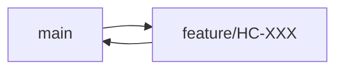
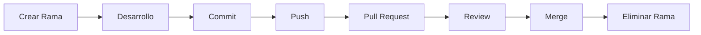

# Branch Strategy

> Este documento define la estrategia oficial de ramas para HomeCapital. Su propósito es mantener un flujo de trabajo simple, escalable y consistente durante todo el ciclo de vida del proyecto.

---

# Objetivos

La estrategia de ramas busca:

- Mantener un historial limpio.
- Facilitar el desarrollo paralelo.
- Reducir conflictos de integración.
- Permitir una evolución gradual del flujo de trabajo.
- Garantizar estabilidad en cada versión publicada.

---

# Filosofía

HomeCapital seguirá el principio de **"la estrategia más simple que resuelva el problema actual"**.

Mientras el proyecto sea desarrollado por un único desarrollador, se utilizará una estrategia simplificada.

Cuando el proyecto crezca o participe más de un desarrollador, la estrategia evolucionará sin afectar el historial del repositorio.

---

# Estrategia actual

Actualmente existen únicamente dos tipos de ramas.

| Rama | Propósito |
|-------|-----------|
| `main` | Rama principal y estable |
| `feature/*` | Desarrollo de nuevas funcionalidades |

---

# Flujo de trabajo



Cada nueva funcionalidad se desarrolla en una rama independiente creada desde `main`.

Una vez finalizada y aprobada mediante Pull Request, la rama se integra nuevamente en `main` mediante **Squash and Merge**.

---

# Convención de nombres

## Funcionalidades

```text
feature/HC-001-engineering-handbook

feature/HC-002-coding-standards

feature/HC-010-authentication
```

---

## Correcciones

```text
fix/HC-035-login-error
```

---

## Documentación

```text
docs/HC-004-branch-strategy
```

---

## Refactorizaciones

```text
refactor/account-module
```

---

## Hotfix

```text
hotfix/security-patch
```

---

# Ciclo de vida de una rama



Toda rama deberá eliminarse una vez integrada.

---

# Reglas

## Una rama = Una Issue

Cada rama debe estar asociada a una única Issue.

---

## Un Pull Request = Una rama

No mezclar funcionalidades distintas en un mismo Pull Request.

---

## Ramas cortas

Las ramas deberán vivir el menor tiempo posible.

Objetivo:

- Menos conflictos.
- Revisiones pequeñas.
- Integración continua.

---

## Actualización de ramas

Antes de comenzar un nuevo desarrollo:

```bash
git checkout main
git pull origin main
```

Luego crear la nueva rama:

```bash
git checkout -b feature/HC-004-branch-strategy
```

---

# Evolución futura

Cuando HomeCapital requiera desarrollo paralelo o múltiples colaboradores, la estrategia evolucionará incorporando una rama `develop`.

```text
main
│
├── develop
│
├── feature/*
├── fix/*
├── release/*
└── hotfix/*
```

Esta transición será documentada mediante un ADR antes de implementarse.

---

# Protección de ramas

La rama `main` deberá contar con las siguientes protecciones:

- Pull Request obligatorio.
- Revisión aprobada.
- Sin conflictos pendientes.
- Historial lineal mediante Squash and Merge.
- Eliminación automática de ramas fusionadas.

---

# Buenas prácticas

- Crear ramas únicamente cuando exista una Issue.
- Mantener nombres descriptivos.
- Eliminar ramas obsoletas.
- Evitar ramas de larga duración.
- Sincronizar siempre antes de comenzar una tarea.

---

# Prohibiciones

No está permitido:

- Trabajar directamente sobre `main`.
- Reutilizar una rama para múltiples tareas.
- Hacer merge sin revisión.
- Mantener ramas abandonadas.

---

# Ejemplo práctico

Issue:

```
HC-018
```

Rama:

```
feature/HC-018-budget-module
```

Pull Request:

```
HC-018 - Budget Module
```

Merge:

```
Squash and Merge
```

La rama se elimina automáticamente después del merge.

---

# Referencias

- Git Documentation
- GitHub Flow
- Trunk Based Development
- Conventional Commits

---

# Historial

| Versión | Fecha | Descripción |
|----------|-------|-------------|
| 1.0.0 | 2026-08-04 | Creación del documento |
