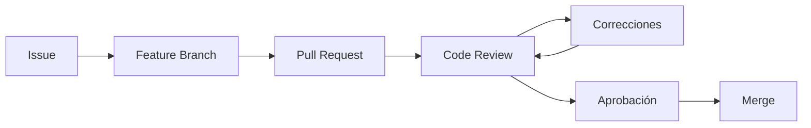

# Code Review Checklist

> Este documento establece el proceso y los criterios oficiales para revisar código antes de aprobar un Pull Request en HomeCapital.

---

# Objetivo

Garantizar que todo cambio integrado al proyecto cumpla con los estándares de calidad definidos durante el Sprint 0.5.

La revisión de código busca:

- Detectar errores tempranamente.
- Mantener la consistencia.
- Reducir deuda técnica.
- Compartir conocimiento.
- Preservar la arquitectura del proyecto.

---

# Principios

Toda revisión deberá ser:

- Objetiva.
- Constructiva.
- Basada en evidencia.
- Centrada en el código, no en la persona.
- Orientada a mejorar el proyecto.

---

# Flujo de revisión

---

# Checklist General

## Arquitectura

- [ ] Respeta la arquitectura del proyecto.
- [ ] No rompe responsabilidades.
- [ ] No introduce dependencias innecesarias.
- [ ] Sigue los principios SOLID.
- [ ] Mantiene bajo acoplamiento.

---

## Código

- [ ] El código es legible.
- [ ] Los nombres son descriptivos.
- [ ] No existen métodos excesivamente largos.
- [ ] No existen clases con múltiples responsabilidades.
- [ ] No existe código duplicado.

---

## Laravel

- [ ] Se utilizan Form Requests para validaciones.
- [ ] No existe lógica de negocio en los controladores.
- [ ] Los modelos representan entidades y no concentran lógica compleja.
- [ ] Se respetan las convenciones del proyecto.

---

## Base de Datos

- [ ] Las migraciones siguen las convenciones.
- [ ] No existen consultas innecesarias.
- [ ] Los índices son adecuados.
- [ ] Se respetan claves foráneas y restricciones.

---

## Frontend

- [ ] Componentes pequeños y reutilizables.
- [ ] Uso de Composition API.
- [ ] TypeScript sin `any`.
- [ ] No existe lógica excesiva en la vista.

---

## Seguridad

- [ ] No existen credenciales en el código.
- [ ] No existen secretos en el repositorio.
- [ ] Validación de entradas.
- [ ] Escape de datos cuando corresponde.
- [ ] Autorización aplicada correctamente.

---

## Rendimiento

- [ ] No existen consultas N+1.
- [ ] Se evita trabajo innecesario.
- [ ] No hay cálculos repetitivos.

---

## Testing

Cuando aplique:

- [ ] Unit Tests.
- [ ] Feature Tests.
- [ ] Todos los tests pasan correctamente.

---

## Documentación

- [ ] Documentación actualizada.
- [ ] README actualizado si aplica.
- [ ] ADR actualizada cuando corresponda.

---

## Git

- [ ] Rama correctamente nombrada.
- [ ] Commits siguen Conventional Commits.
- [ ] Pull Request correctamente asociado a la Issue.

---

# Severidad de observaciones

## 🔴 Crítica

Debe corregirse antes del merge.

Ejemplos:

- Vulnerabilidad.
- Error funcional.
- Violación de arquitectura.
- Falla de compilación.

---

## 🟠 Alta

Debe corregirse salvo justificación.

Ejemplos:

- Código duplicado.
- Bajo rendimiento.
- Mala separación de responsabilidades.

---

## 🟡 Media

Se recomienda corregir.

Ejemplos:

- Nombres poco claros.
- Métodos largos.
- Comentarios innecesarios.

---

## 🔵 Baja

Mejoras opcionales.

Ejemplos:

- Formato.
- Legibilidad.
- Orden de imports.

---

# Criterios de aprobación

Un Pull Request podrá aprobarse cuando:

- Todos los criterios críticos estén resueltos.
- No existan errores de compilación.
- La documentación esté actualizada.
- El código siga los Coding Standards.
- Se cumpla la Definition of Done.

---

# Aplicación práctica en HomeCapital

Antes de aprobar cualquier Pull Request, el revisor deberá verificar como mínimo:

- Cumplimiento de los documentos de ingeniería.
- Uso correcto de la estructura del proyecto.
- Consistencia con la arquitectura definida.
- Ausencia de deuda técnica evidente.

---

# Referencias

- Engineering Handbook
- Coding Standards
- Git Workflow
- Branch Strategy
- Commit Convention
- Definition of Ready & Definition of Done

---

# Historial

| Versión | Fecha | Descripción |
|----------|-------|-------------|
| 1.0.0 | 2026-08-04 | Creación del documento |
