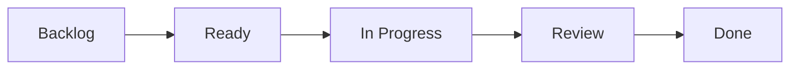

# Definition of Ready & Definition of Done

> Este documento define los criterios mínimos para iniciar y finalizar cualquier tarea dentro del proyecto HomeCapital.

---

# Objetivo

Establecer un conjunto de reglas que permitan garantizar que todas las tareas comiencen con suficiente información y finalicen cumpliendo los estándares de calidad definidos por el proyecto.

---

# ¿Qué es Definition of Ready?

Una Issue está **Ready** cuando posee toda la información necesaria para que el desarrollo pueda comenzar sin incertidumbre.

El objetivo del DoR es evitar comenzar trabajo con requisitos incompletos o ambiguos.

---

# Definition of Ready

Una Issue podrá pasar de **Backlog** a **Ready** únicamente cuando cumpla todos los siguientes criterios.

| Criterio | Obligatorio |
|----------|:-----------:|
| Tiene un título claro | ✅ |
| Tiene una descripción | ✅ |
| Tiene objetivo definido | ✅ |
| Tiene alcance delimitado | ✅ |
| Tiene Milestone asignado | ✅ |
| Tiene etiquetas | ✅ |
| Tiene prioridad | ✅ |
| Tiene criterios de aceptación | ✅ |
| Tiene entregables definidos | ✅ |
| Existe documentación previa si aplica | ✅ |

---

# Criterios de aceptación

Cada Issue deberá responder como mínimo:

- ¿Qué se va a construir?
- ¿Por qué se necesita?
- ¿Cuál es el resultado esperado?
- ¿Qué archivos podrían verse afectados?
- ¿Cómo se validará que está terminada?

---

# Ejemplo de Issue Ready

```
HC-025

Título:
Crear módulo de presupuestos.

Objetivo:
Permitir registrar presupuestos mensuales.

Entregables:
- Modelo
- Migración
- Controlador
- API
- Documentación

Estado:
Ready
```

---

# ¿Qué es Definition of Done?

Una tarea estará **Done** únicamente cuando cumpla todos los criterios de calidad establecidos.

No basta con que "funcione".

Debe cumplir además con documentación, trazabilidad y revisión.

---

# Definition of Done

## Desarrollo

- Código implementado.
- Sin errores de compilación.
- Sin errores del linter.
- Sin warnings críticos.
- Cumple los Coding Standards.

---

## Arquitectura

- Respeta la arquitectura definida.
- No introduce deuda técnica innecesaria.
- Mantiene separación de responsabilidades.

---

## Documentación

- Documentación actualizada.
- Diagramas actualizados cuando corresponda.
- CHANGELOG actualizado (cuando aplique).

---

## Git

- Commit siguiendo Conventional Commits.
- Rama correctamente nombrada.
- Pull Request creado.
- Sin conflictos.

---

## Calidad

- Revisión técnica realizada.
- Código legible.
- Sin código comentado.
- Sin código muerto.
- Sin archivos temporales.

---

## Testing

Cuando aplique:

- Unit Tests.
- Feature Tests.
- Integración exitosa.

---

## Gestión

- WORKLOG actualizado.
- PROJECT_STATUS actualizado.
- Issue cerrada.
- Sprint actualizado si corresponde.

---

# Checklist oficial

## Antes de comenzar una Issue

- [ ] Issue creada.
- [ ] Milestone asignado.
- [ ] Etiquetas configuradas.
- [ ] Objetivo definido.
- [ ] Alcance claro.
- [ ] Criterios de aceptación definidos.
- [ ] Dependencias identificadas.

---

## Antes de cerrar una Issue

- [ ] Desarrollo finalizado.
- [ ] Documentación actualizada.
- [ ] Commit realizado.
- [ ] Push realizado.
- [ ] Pull Request aprobado.
- [ ] WORKLOG actualizado.
- [ ] PROJECT_STATUS actualizado.
- [ ] Issue cerrada.

---

# Flujo de estados



---

# Excepciones

En casos excepcionales una Issue podrá avanzar sin cumplir un criterio únicamente cuando exista una justificación documentada y aprobada.

---

# Mejora continua

El Definition of Ready y Definition of Done serán revisados al finalizar cada Release Mayor para adaptarse a la evolución del proyecto.

---

# Referencias

- Scrum Guide
- GitHub Projects
- Engineering Handbook
- Coding Standards

---

# Historial

| Versión | Fecha | Descripción |
|----------|-------|-------------|
| 1.0.0 | 2026-08-04 | Creación del documento |
