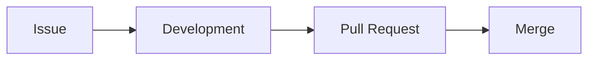
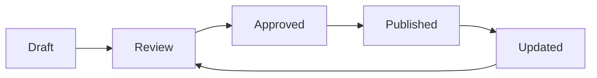

# Documentation Standards

> This document defines the official documentation standards for HomeCapital. It establishes how technical documentation must be created, organized, maintained, versioned and reviewed throughout the project lifecycle.

---

# Objectives

The documentation strategy aims to:

- Maintain a single source of truth.
- Standardize all technical documents.
- Improve readability.
- Facilitate onboarding.
- Reduce duplicated information.
- Keep documentation synchronized with the source code.
- Improve long-term maintainability.

---

# Documentation Principles

Every document must follow these principles.

## Single Source of Truth (SSOT)

Each topic must be documented only once.

Example:

✔ Database conventions belong only in:

```
docs/04-database/
```

Never duplicate database conventions inside API documentation.

---

## Documentation as Code

Documentation is part of the project.

It must:

- Live inside Git.
- Be reviewed.
- Be versioned.
- Follow Pull Requests.
- Be maintained like source code.

---

## Living Documentation

Documentation must evolve together with the software.

Whenever a feature changes:

- Update documentation.
- Update diagrams.
- Update examples.
- Update references.

Never postpone documentation updates.

---

## Documentation First

Whenever possible:

1. Define requirements.
2. Define architecture.
3. Write documentation.
4. Implement code.

---

# Official Language

| Resource | Language |
|-----------|----------|
| Source Code | English |
| Commits | English |
| Branches | English |
| Pull Requests | English |
| Issues | English |
| Technical Documentation | English |
| Functional Documentation | English (preferred) |

---

# Documentation Structure

```
docs/
│
├── 00-engineering
├── 01-product
├── 02-requirements
├── 03-architecture
├── 04-database
├── 05-api
├── 06-frontend
├── 07-testing
├── 08-devops
├── 09-adr
├── 10-roadmap
├── 11-decisions
├── 12-meetings
├── assets
│   ├── diagrams
│   └── images
└── templates
```

Each directory represents a specific documentation domain.

---

# File Naming Convention

Files must use:

- lowercase
- kebab-case
- descriptive names
- `.md`

Correct:

```
coding-standards.md

testing-strategy.md

database-conventions.md

architecture-overview.md
```

Incorrect:

```
Coding Standards.md

TestingStrategy.md

New File.md

document1.md
```

---

# Required Metadata

Every document must start with:

```yaml
---
Document ID:
Title:
Version:
Status:
Owner:
Author:
Reviewer:
Created:
Last Updated:
Related Sprint:
Related Issue:
Category:
---
```

---

# Standard Document Structure

Every technical document should contain the following sections whenever applicable.

```
# Purpose

# Scope

# Background

# Definitions

# Content

# Best Practices

# HomeCapital Implementation

# References

# Changelog
```

Some sections may be omitted if they are not applicable.

---

# Headings

Use only one H1.

Example:

```
# API Standards

## Objectives

### Requests

#### Validation
```

Never skip heading levels.

Incorrect:

```
#

###

##
```

---

# Tables

Use tables for:

- conventions
- comparisons
- configurations
- responsibilities
- matrices

Example:

| Layer | Responsibility |
|--------|----------------|
| Controller | HTTP |
| Service | Business Logic |
| Repository | Data Access |

---

# Lists

Use unordered lists for collections.

Example:

- Laravel
- Vue
- PostgreSQL
- Docker

Use ordered lists for processes.

Example:

1. Create Issue
2. Create Branch
3. Develop
4. Commit
5. Pull Request

---

# Code Blocks

Always specify the language.

Example

```php
class AccountService
{
    //
}
```

Supported languages:

- php
- ts
- vue
- sql
- bash
- yaml
- json
- xml
- dockerfile

---

# Diagrams

Preferred format:

Mermaid

Supported diagrams:

- Flowchart
- Sequence Diagram
- State Diagram
- Class Diagram
- ER Diagram
- C4 (simplified)
- Git Graph

Example:



---

# Images

Images must be stored in:

```
docs/assets/images/
```

Diagrams:

```
docs/assets/diagrams/
```

Naming:

```
authentication-flow.svg

database-schema.png

architecture-overview.svg
```

---

# Cross References

Whenever another document is referenced:

```
## Related Documents

- Engineering Handbook
- Coding Standards
- ADR-001
- Git Workflow
```

Avoid duplicated explanations.

---

# Versioning

Every relevant modification must update the history table.

Example:

| Version | Date | Description |
|----------|------|-------------|
| 1.0.0 | 2026-08-04 | Initial version |
| 1.1.0 | 2026-09-12 | Added examples |
| 1.2.0 | 2026-10-01 | Updated standards |

---

# Review Process

Before approving a document verify:

- Grammar
- Spelling
- Consistency
- Formatting
- Diagrams
- References
- Metadata
- Version
- Changelog

---

# Documentation Lifecycle



---

# Documentation Quality Checklist

Before publishing:

- [ ] Metadata completed
- [ ] Grammar reviewed
- [ ] References added
- [ ] Mermaid diagrams validated
- [ ] Code blocks formatted
- [ ] Tables aligned
- [ ] Version updated
- [ ] Changelog updated
- [ ] Related documents linked

---

# HomeCapital Implementation

Example:

A new Budget Module should include:

```
01-product
    Product Vision

02-requirements
    Functional Requirements

03-architecture
    Module Architecture

04-database
    ER Diagram

05-api
    Endpoints

06-frontend
    UI Documentation

07-testing
    Testing Strategy

09-adr
    Architectural Decisions
```

Every feature should be documented across the appropriate domains instead of concentrating everything in a single document.

---

# Best Practices

- Write concise documents.
- Avoid duplicated information.
- Keep examples updated.
- Prefer diagrams over long paragraphs.
- Use Markdown consistently.
- Review documentation in every Pull Request.

---

# Anti-Patterns

Avoid:

- Outdated documentation.
- Multiple documents describing the same concept.
- Broken links.
- Missing diagrams.
- Missing changelog.
- Generic file names.
- Mixing functional and technical documentation.

---

# Related Documents

- Engineering Handbook
- Coding Standards
- Git Workflow
- Branch Strategy
- Commit Convention
- Definition of Ready & Definition of Done
- Code Review Checklist
- Testing Strategy

---

# References

- Markdown Guide
- Mermaid Documentation
- Docs as Code
- Diátaxis Framework
- C4 Model
- Semantic Versioning

---

# Changelog

| Version | Date | Description |
|----------|------|-------------|
| 1.0.0 | 2026-08-04 | Initial version |
