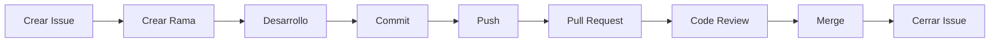

# Git Workflow

> Este documento define el flujo de trabajo oficial con Git y GitHub para el desarrollo de HomeCapital. Su objetivo es garantizar un historial limpio, trazabilidad completa y una colaboración ordenada.

---

# Objetivos

El flujo de trabajo busca:

- Mantener un historial de commits claro.
- Facilitar revisiones de código.
- Evitar conflictos innecesarios.
- Garantizar trazabilidad entre código y documentación.
- Preparar el proyecto para trabajo colaborativo.

---

# Flujo General

Todo desarrollo seguirá el siguiente proceso:



---

# Flujo de una tarea

1. Crear o asignar una Issue.
2. Asociar la Issue a un Sprint (Milestone).
3. Crear una rama desde `develop`.
4. Implementar los cambios.
5. Realizar commits pequeños y descriptivos.
6. Subir la rama al repositorio remoto.
7. Crear un Pull Request.
8. Realizar la revisión de código.
9. Corregir observaciones (si existen).
10. Hacer merge a `develop`.
11. Cerrar la Issue.

---

# Estrategia de ramas

## Rama principal

| Rama | Propósito |
|-------|-----------|
| main | Versiones estables y releases |
| develop | Integración del desarrollo |

---

## Ramas de trabajo

| Tipo | Ejemplo |
|------|----------|
| feature | feature/HC-003-git-workflow |
| fix | fix/HC-015-login-error |
| docs | docs/HC-002-coding-standards |
| refactor | refactor/account-service |
| hotfix | hotfix/security-patch |
| release | release/v1.0.0 |

---

# Creación de una nueva tarea

```bash
git checkout develop
git pull origin develop

git checkout -b docs/HC-003-git-workflow
```

---

# Commits

Todos los commits deberán seguir Conventional Commits.

Ejemplos:

```text
feat(accounts): implement account creation

fix(auth): resolve login validation

docs(engineering): define git workflow (HC-003)

refactor(api): simplify transaction service

test(accounts): add unit tests
```

---

# Frecuencia de commits

Se recomienda realizar commits:

- Después de completar una unidad lógica de trabajo.
- Antes de realizar cambios grandes.
- Antes de finalizar la sesión de trabajo.

Evitar:

- Commits gigantes.
- Commits con múltiples objetivos.
- Commits sin descripción.

---

# Pull Requests

Todo Pull Request deberá:

- Estar asociado a una Issue.
- Tener una descripción clara.
- Pasar la revisión técnica.
- Tener la documentación actualizada.
- No contener conflictos.

---

# Merge Strategy

Se utilizará:

**Squash and Merge**

Beneficios:

- Historial limpio.
- Un commit por Issue.
- Fácil trazabilidad.

---

# Sincronización

Antes de comenzar cualquier desarrollo:

```bash
git checkout develop
git pull origin develop
```

Después crear la rama correspondiente.

---

# Resolución de conflictos

Cuando existan conflictos:

1. Actualizar la rama.
2. Resolver manualmente.
3. Ejecutar pruebas.
4. Realizar un nuevo commit.
5. Actualizar el Pull Request.

Nunca realizar merge sin entender el conflicto.

---

# Buenas prácticas

- Una Issue = Una rama.
- Una rama = Un Pull Request.
- Un Pull Request = Un objetivo claro.
- Commits pequeños y frecuentes.
- Mantener `main` siempre estable.
- Mantener `develop` compilando correctamente.

---

# Prohibiciones

No está permitido:

- Hacer commits directamente sobre `main`.
- Hacer commits directamente sobre `develop`.
- Hacer push con código sin revisar.
- Hacer merge sin Pull Request.
- Hacer force push sobre ramas compartidas.

---

# Checklist antes del Push

- Código compilando.
- Pruebas ejecutadas.
- Documentación actualizada.
- Commit siguiendo Conventional Commits.
- Issue actualizada.

---

# Herramientas utilizadas

- Git
- GitHub
- GitHub Projects
- GitHub Issues
- GitHub Milestones
- Pull Requests

---

# Referencias

- Git Documentation
- GitHub Flow
- Conventional Commits
- Semantic Versioning

---

# Historial

| Versión | Fecha | Descripción |
|----------|-------|-------------|
| 1.0.0 | 2026-08-04 | Creación del documento |
